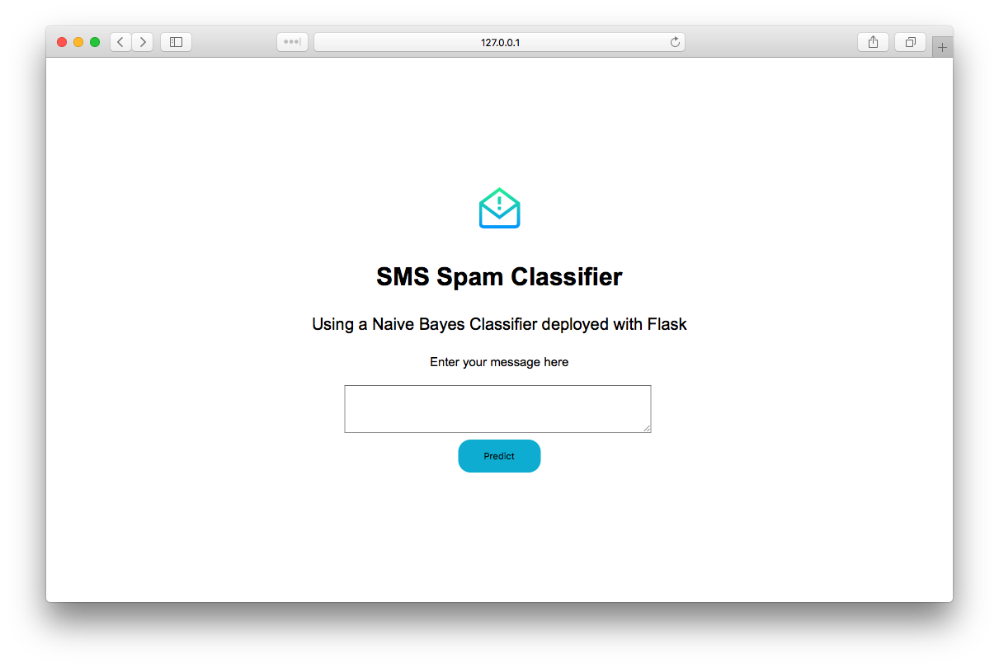
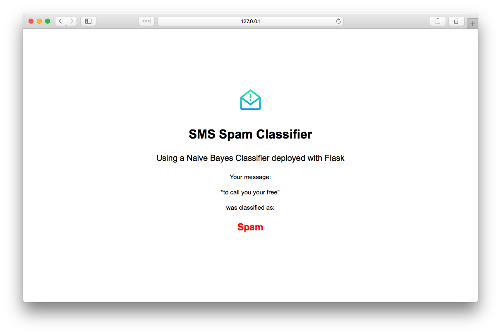

# An SMS Naive Bayes Spam Classifier deployed with Flask

Using the SMS Spam collection dataset from UCI Machine Learning: https://www.kaggle.com/uciml/sms-spam-collection-dataset

Data exploration, feature engineering, and model training were performed here: [Train-Naive-Bayes.ipynb](https://nbviewer.jupyter.org/github/elderpinzon/DataProjects/blob/master/SMS-Spam-Naive-Bayes-Flask/Train-Naive-Bayes.ipynb)

The model is deployed using Flask. Some screenshots below:

 
